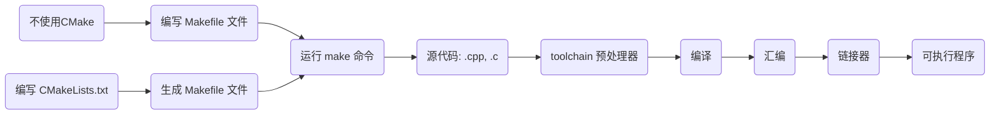

# CMake 学习


## 简介

> CMake 是一个跨平台的自动化构建工具，用于简化各种编译环境下项目的构建、测试和打包过程。它主要针对 C/C++ 项目，但也支持其他编程语言。CMake 不直接构建项目，而是生成原生构建系统（例如 Makefile 或 Visual Studio 项目）的输入文件。这使得项目可以在多个平台上使用相同的 CMakeLists.txt 文件进行构建。

## 了解 Makefile

> `Makefile` 是一个描述如何构建和链接程序的文本文件，它包含了一系列规则和依赖关系。
>
> 用于自动化编译和链接程序。Makefile 是由 GNU Make 工具处理的文件，可以在各种平台上使用。

Makefile 在不同平台之间存在差异，通常与操作系统、编译器、工具链和文件路径有关

以下列举了几点，但不是全部：

1. **路径分隔符**：Windows 使用反斜杠（`\`）作为路径分隔符，而 Unix-like 系统使用正斜杠（`/`）。
2. **可执行文件扩展名**：Windows 上的可执行文件扩展名通常为 `.exe`，而在 Unix-like 系统上则没有扩展名。
3. **编译器和工具链**：不同平台可能会使用不同的编译器和工具链。例如，在 Linux 和 macOS 上，你可能使用 GCC 或 Clang，而在 Windows 上，你可能使用 Visual Studio 或 MinGW。
4. **外部库和依赖关系**：不同平台上的外部库和依赖关系可能有所差异。例如，库文件在 Windows 上通常有 `.lib` 或 `.dll` 扩展名，在 Unix-like 系统上通常有 `.a` 或 `.so` 扩展名。同时，库的安装位置也可能不同。

## 了解 make

> `make` 命令是一个用于自动化构建过程的工具，它读取 `Makefile` 文件，并根据其中的规则和依赖关系执行相应的操作。`make` 命令的基本工作流程如下：
>
> 1. 读取当前目录下的 `Makefile` 文件。
> 2. 查找要构建的目标（默认为 `Makefile` 中的第一个目标）。
> 3. 确定目标文件的依赖关系。如果依赖的文件不存在或比目标文件的修改时间更晚，则重新生成它们。
> 4. 根据规则执行相应的编译、链接等操作来生成目标文件。

## 编译原理

1. 源文件(.cpp, .c) 
2. toolchain(预处理器) :把头文件展示，对应的宏展开、去除注释
3. 编译
4. 汇编 (.obj / .o)
5. 链接器成一个可执行文件


**生成可执行文件的流程中，编译和链接过程是关键步骤。这个过程可以分为两个阶段：编译阶段（Compilation）和链接阶段（Linking）。**

1. **编译阶段**：

   编译阶段是将源代码文件（如 `.c`、`.cpp` 等）转换为目标文件（如 `.o`、`.obj` 等）的过程。在这个阶段，编译器（如 gcc、g++ 等）主要执行以下任务：

   - 预处理（Preprocessing）：处理源代码中的宏定义、条件编译指令和头文件包含等操作。
   - 词法分析（Lexical Analysis）：将预处理后的源代码分解为词素（Tokens），例如关键字、变量名、常量等。
   - 语法分析（Syntax Analysis）：根据词法分析得到的词素，结合编程语言的语法规则，生成抽象语法树（Abstract Syntax Tree，AST）。
   - 语义分析（Semantic Analysis）：检查抽象语法树中的错误，例如类型不匹配、未声明的变量等，并进行一些必要的优化。
   - 代码生成（Code Generation）：将抽象语法树转换为目标机器的低级代码（例如汇编代码），并进行寄存器分配、指令调度等优化。
   - 汇编（Assembly）：将生成的汇编代码转换为目标文件（如 `.o`、`.obj` 等）。

2. **链接阶段**：

   链接阶段是将多个目标文件以及可能需要的库文件连接成一个单独的可执行文件（或静态库/动态库）的过程。链接器（如 ld、link 等）主要执行以下任务：

   - 符号解析（Symbol Resolution）：链接器将各个目标文件中定义和引用的符号（如函数名、全局变量名等）进行匹配，确保所有引用的符号都能找到对应的定义。
   - 地址分配（Address Allocation）：链接器为每个目标文件中的函数和变量分配运行时的内存地址。
   - 段合并（Section Merging）：链接器将具有相同属性的目标文件的段（如代码段、数据段等）合并成一个段，并计算它们在最终可执行文件中的位置。
   - 重定位（Relocation）：链接器更新目标文件中所有对函数和变量的引用，使它们指向正确的运行时地址。
   - 库文件处理（Library Handling）：链接器处理依赖的库文件，将需要的库函数包含到生成的可执行文件中。


### CMake 的基本原理如下：

1. **配置过程**：CMake 通过读取源代码目录下的 CMakeLists.txt 配置文件来指导整个构建过程。CMakeLists.txt 文件包含了描述项目结构和构建选项的一系列 CMake 指令。

2. **生成构建文件**：CMake 根据源代码目录中的 CMakeLists.txt 文件生成特定于目标构建系统的构建文件，例如 Makefile（UNIX/Linux系统）或 MSBuild 项目文件（Windows系统）。

3. **编译和链接**：使用目标构建系统（例如 GNU Make 工具或 Visual Studio IDE）解析生成的构建文件并执行编译和链接过程，从而完成目标程序、库文件等的构建。

4. **安装和打包**：可选地，你可以配置 CMakeLists.txt 文件以支持安装步骤，将目标文件和相关资源复制到正确的安装位置。你还可以使用CMake生成包含构建结果的安装包，以便部署和发布。



### CMake 的核心优势：

- 跨平台支持：CMake 可以在 Windows、Linux 和 macOS 等操作系统上运行，使得源代码具有更好的可移植性。
- 灵活性：CMake 能自动检测编译器、链接器和开发库，支持多种编译器和构建选项配置。
- 依赖管理：CMake 支持外部库的自动查找和链接，简化了复杂项目的构建过程。
- 模块化和扩展性：CMake 提供丰富的内置命令和模块库，同时支持自定义函数和宏，方便用户实现更复杂的构建需求。

## 基础语法

#### 编写 CMakeLists.txt 文件

```cmake
# 指定 cmake 的最低版本 - 可选项
cmake_minimum_required(VERSION 3.26)

# 指定 C++ 标准库的版本（默认会使用编译器的默认C++标准）
set(CMAKE_CXX_STANDARD 17)

# 项目名称，可以直接是一个字符串，同时支持读取变量
project(foundation)

# 打印日志
message(STATUS "Current source directory: ${CMAKE_CURRENT_SOURCE_DIR}")
message(STATUS "Current binary directory: ${CMAKE_CURRENT_BINARY_DIR}")

# PROJECT_SOURCE_DIR CMAKE_CURRENT_SOURCE_DIR 这两个都是cmake自带的宏

# 指定头文件路径
include_directories(${PROJECT_SOURCE_DIR}/include)

# 设置可执行程序输出路径，也对应一个宏，叫做 EXECUTABLE_OUTPUT_PATH，它的值是通过 set 命令进行设置：
# 如果这个路径中的子目录不存在，会自动生成，无需自己手动创建
set(EXECUTABLE_OUTPUT_PATH ${CMAKE_CURRENT_BINARY_DIR}/bin)

# 设置静态库的输出路径
set(LIBRARY_OUTPUT_PATH ${CMAKE_CURRENT_BINARY_DIR}/bin)

# 指定包含的头文件，有多个源文件时以空格隔开
set(SRC_LIST foundation.cpp
        add.cpp
        div.cpp
        mult.cpp
        sub.cpp)
```

注：在 CMakeLists.txt 中，通过 SET 指令 设置的属性默认是字符类型，如果想要设置其它数据类型需要通过

> SET指令的语法是：
> []中的参数为可选项，如不需要可以不写
> SET（VAR［VALUE］［CACHETYPEDOCSTRING［FORCE］］）
>
> - `VAR`: 变量名称，可以为任意字符串。
>
> - `[VALUE]`: （可选）设置给 `VAR` 的值。可以为空或者包含多个值，各个值之间使用空格分隔。如果不提供该参数，那么变量将会被清除（即设为空值）。
>
> - `[CACHE TYPE DOCSTRING]`: (可选) 这个部分用于将变量存储在缓存中，使其可以跨CMake运行共享。这里有三个子参数：
>   - `CACHE`: 表示需要将变量存储到缓存中。如果要将变量存储到缓存中，必须使用 `CACHE` 关键字，并提供相应的 `TYPE` 参数。
>   - `TYPE`: 缓存变量的类型，可以是 `STRING`，`BOOL`，`PATH`，`FILEPATH` 等。
>   - `DOCSTRING`: 为缓存变量提供描述性文档，以便其他开发人员了解变量的用途。
>
> - `[FORCE]`: (可选) 如果存在具有相同名称的缓存变量，此选项将强制更新缓存变量的值和属性（类型及文档），而不管它是否已经被设置。
>
> ```cmake
> SET(MY_FLOAT_NUMBER "3.14")
> // 当需要对这些数字类型的变量执行算术运算时，可以使用MATH(EXPR ...)指令。例如，对上面定义的整数变量MY_NUMBER加5：
> MATH(EXPR MY_NUMBER_PLUS_FIVE "${MY_NUMBER} + 5")
> ```

#### 默认常用宏说明

* PROJECT_SOURCE_DIR：执行的 `cmake` 命令时，后面跟随的路径
* CMAKE_CURRENT_SOURCE_DIR：也就是被执行的 CMakeLists.txt 文件路径

#### 常用参数说明

* aux_source_directory(${CMAKE_CURRENT_BINARY_DIR} *.cpp)

  * 在指定目录下搜索指定类型文件，不会递归搜索子目录

* set(EXECUTABLE_OUTPUT_PATH ${CMAKE_CURRENT_BINARY_DIR}/bin)

  * 设置可执行程序输出路径，也对应一个宏，叫做 EXECUTABLE_OUTPUT_PATH
  * 如果这个路径中的子目录不存在，会自动生成，无需自己手动创建

* set(LIBRARY_OUTPUT_PATH ${CMAKE_CURRENT_BINARY_DIR}/bin)

  * 设置静态库的输出路径

* file(GLOB SRC_LIST ${CMAKE_CURRENT_SOURCE_DIR}/*.cpp)

  * `GLOB` 选项在当前源代码目录中查找所有扩展名为`.cpp`的文件，并将匹配到的文件路径列表存储在`SRC_LIST`变量中，会递归搜索子目录

  * `GLOB`：当前源代码目录中搜索指定模式匹配的文件

  * `GLOB_RECURSE`：这个选项类似于`GLOB`，但它会递归地搜索指定模式匹配的文件。在搜索过程中，它会遍历当前目录及其所有子目录

  * `GLOB_BRACE`：这个选项允许在模式字符串中使用大括号扩展，以匹配多个子模式（仅用于CMake 3.12及更高版本）

    * ```cmake
      file(GLOB_BRACE SRC {*.cpp,*.h})
      ```

* set(CMAKE_INSTALL_PREFIX "${CMAKE_SOURCE_DIR}/install")

  * 自定义安装目录

  

#### 条件语句

```
if(<condition>)
  # 如果条件为真，则执行这里的代码
else()
  # （可选）如果条件为假，则执行这里的代码
endif()
```

1. 判断一个变量是否具有特定值：

   ```cmake
   SET(MY_VARIABLE "Hello")
   if(MY_VARIABLE STREQUAL "Hello")
     message("MY_VARIABLE is 'Hello'")
   endif()
   ```

2. 检查变量是否定义（非空）：

   ```cmake
   if(DEFINED MY_VARIABLE)
     message("MY_VARIABLE is defined")
   endif()
   ```

3. 使用关系运算符进行数值比较：

   ```cmake
   SET(NUMBER 5)
   if(NUMBER LESS 10)
     message("NUMBER is less than 10")
   endif()
   ```

4. 使用逻辑运算符组合多个条件：

   ```cmake
   SET(A 1)
   SET(B 2)
   
   if((A EQUAL 1) AND (B GREATER A))
     message("Both conditions are true")
   endif()
   ```

## 编译、构建

### 直接使用 clang 编译

```c++
// calculate.cpp 内容
void hello() {
    cout << "Hello, World!" << endl;

    cout << "加法：" << add(10, 10) << endl;
    cout << "减法：" << subtract(10, 10) << endl;
    cout << "乘法：" << multiply(10, 10) << endl;
    cout << "除法：" << divide(10, 10) << endl;
}

int main(int argc, char* argv[]) {
    hello();
}

// 编译
$ clang++ -std=c++17 -o app -I../include ../src/*.cpp
$ ./app
```

### 使用 CMake 进行编译 

```shell
# 需要在 CMakeLists.txt 文件的路径下执行
$cmake .
# 指定参数：cmake . -Dxxx, xxx代表你要指定的参数名
# eg.: 指定C++的编译版本为17 
# 指定构架：DCMAKE_OSX_ARCHITECTURES=x86_64 / arm64
$cmake . -DCMAKE_CXX_STANDARD=17 -DCMAKE_OSX_ARCHITECTURES=x86_64
```

#### 内部构建和外部构建

1. 上述的例子，是在 CMakeLists.txt 文件中的路径下构建的，称是内部构建，它生产的临时文件特别多，不方便清理、管理

2. 外部构建：就会把生成的临时文件放在指定的目录下，不会对源文件有任何影响强烈使用外部构建方式

   ```shell
   # 创建指定的构建目录，构建产生的临时文件全部会在 build 目录下
   # 建立一个 build 目录，可以在任何地方，建议在当前目录下
   $mkdir build && cd build
   # 执行cmake，并指定 CMakeLists.txt 路径，.. 表示上层目录
   $cmake ..
   # 指定参数：cmake . -Dxxx, xxx代表你要指定的参数名
   # eg.: 指定C++的编译版本为17
   $cmake . -DCMAKE_CXX_STANDARD=17
   ```

#### 让项目看起来更像一个工程

- 添加一个子目录 doc，用来放置这个工程的文档 exec.txt
- 在工程目录添加文本文件 COPYRIGHT, README
- 在工程目录添加一个 [run_exec.sh](run_exec.sh) 脚本，用来调用 exec 二进制
- 将构建后的目标文件放入构建目录的 bin 子目录
- 将 doc 目录 的内容以及 COPYRIGHT/README 安装到 /usr/share/doc/cmake/

需要在原来 CMakeLists.txt 的基础上增加如下命令

```cmake
install(FILES COPYRIGHT README DESTINATION local/doc/exec)
install(PROGRAMS run_exec.sh DESTINATION local/bin)
install(DIRECTORY doc/ DESTINATION /usr/share/doc/exec/)
```

#### 生成可执行文件

1. 在原来 CMakeLists.txt 的基础上增加如下命令

   ```cmake
   # 生成一个可执行程序（名称，要包含的源文件）
   add_executable("exec" ${SRC_LIST})
   ```

2. 再执行上面讲到编译命令

#### 制作静态库

```makefile
# 生成一个动态库
add_library(foundation ${SRC_LIST})
# 指定库文件的输出路径，如果路径不存在会自动创建，如果没有指定则生成到当前的构建目录下
set(LIBRARY_OUTPUT_PATH /.../path/bin)
```

由于在`Linux`下生成的静态库默认不具有可执行权限，所以在指定静态库生成的路径的时候就不能使用 `EXECUTABLE_OUTPUT_PATH` 宏了，而应该使用 `LIBRARY_OUTPUT_PATH`，这个宏对应静态库文件和动态库文件都适用。

## 多平台交叉编译

### 环境配置

要在 macOS 平台编译适用 windows 平台的产物，需要配置如下环境工具：

**MinGW**：是一个为 Windows 提供最小 GNU 环境的工具集，包括了 GCC 编译器和 GNU Make 工具。

> 在 macOS 系统上开发时，你不一定需要安装 MinGW。MinGW（Minimalist GNU for Windows）主要用于在 Windows 系统上提供一个轻量级的 GNU 开发环境，包括 GCC 编译器和其他相关工具。如果你目前只需在 macOS 上进行开发和构建操作，那么 macOS 自带的编译器（如 Clang）和开发工具就足够了。
>
> 然而，如果你打算在 macOS 上为 Windows 平台交叉编译项目，那么你可能需要获取适用于 macOS 的 MinGW-w64 工具链。MinGW-w64 是 MinGW 的一个分支，它支持 64 位 Windows 系统，并提供了更多功能和改进。通过使用 MinGW-w64 交叉编译器，你可以在 macOS 上构建目标为 Windows 的可执行文件。

依赖：mingw-w64

```Bash
brew install mingw-w64
```

创建/编写 `toolchain_windows.cmake` 文件

```CMake
set(CMAKE_SYSTEM_NAME Windows)

# 设置交叉编译器
set(TOOLCHAIN_PREFIX /opt/homebrew/Cellar/mingw-w64/11.0.1/toolchain-i686)
set(CMAKE_C_COMPILER ${TOOLCHAIN_PREFIX}/bin/i686-w64-mingw32-gcc)
set(CMAKE_CXX_COMPILER ${TOOLCHAIN_PREFIX}/bin/i686-w64-mingw32-g++)
set(CMAKE_AR ${TOOLCHAIN_PREFIX}/bin/i686-w64-mingw32-ar CACHE FILEPATH "Archiver")

#set(TOOLCHAIN_PREFIX /opt/homebrew/Cellar/mingw-w64/11.0.1/toolchain-x86_64)
#set(CMAKE_C_COMPILER ${TOOLCHAIN_PREFIX}/bin/x86_64-w64-mingw32-gcc)
#set(CMAKE_CXX_COMPILER ${TOOLCHAIN_PREFIX}/bin/x86_64-w64-mingw32-g++)
#set(CMAKE_AR ${TOOLCHAIN_PREFIX}/bin/x86_64-w64-mingw32-ar CACHE FILEPATH "Archiver")

# 设置有关系统和目标平台的变量
set(CMAKE_FIND_ROOT_PATH_MODE_PROGRAM NEVER)
set(CMAKE_FIND_ROOT_PATH_MODE_LIBRARY ONLY)
set(CMAKE_FIND_ROOT_PATH_MODE_INCLUDE ONLY)
set(CMAKE_FIND_ROOT_PATH_MODE_PACKAGE ONLY)
```

编译

```Bash
cd build
cmake -DCMAKE_TOOLCHAIN_FILE=../toolchain_windows.cmake ..
```

下篇文章将详细讲解交叉编译


[CMake Document](https://cmake.org/cmake/help/latest/manual/cmake-commands.7.html)
