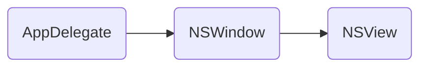
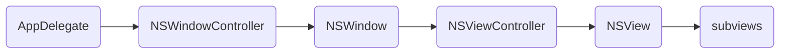
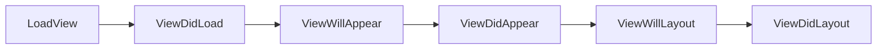
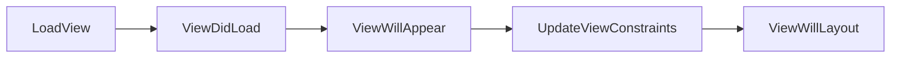
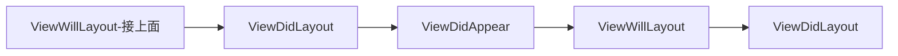

# macOS 开发实用技巧、实践

## 工程创建：

1. Storyboard

   此方法是苹果推荐的方式

   优点：主窗口的层次管理及生命周期管理、菜单、基本的配置系统会做好，我们无需额外配置。

   缺点：`.storyboard` 在多人开发下，不便于文件的维护

2. Xib：在没有 storyboard 方式之前，一种较较古老的创建方式

   跟 storyboard 主要的区别：窗口、视图、控制器没有分层管理，扩展及维护性都弱于 storyboard 的方式

3. 纯代码

   优点：在多人开发下，便于文件的维护

   缺点：主窗口的层次管理及生命周期管理、菜单、基本的配置系统会做好，需手动额外配置
   
   

## NSApplication 的基础层次结构：

### 方式一


```swift
AppDelegate
└── NSWindow
    └── NSView
        └── subviews
```


### 方式二


```
AppDelegate
└── NSWindowController
    └── NSWindow
        └── NSViewController
            └── NSView
                └── subviews
```


## 窗口与窗口控制器

> NSWindowController 是用来管理 window 的控制器，能够管理 xib 或 storyboard 文件中加载的的窗口视图。在 Document-Based 应用中，NSWindowController 也负责创建和管理 document 的 window。

### 窗口结构

> NSWindow 是 macOS 应用程序中的一个重要类，它负责管理和呈现应用程序中的窗口。NSWindow 继承自 NSResponder，并在Cocoa 的用户界面层实现了窗口的功能。以下是 NSWindow 的主要结构和组件：

1. **标题栏（titlebar）**：位于窗口顶部，通常显示标题文本、图标以及关闭、最小化和最大化按钮。
2. **内容视图（contentView）**：窗口的主体区域。这是您在其中放置应用程序的UI元素（如按钮、文本框等）的地方。内容视图由一个NSView对象（或其子类）表示。
3. **contentBorder**：底部栏
4. **代理**：NSWindow 可以有一个关联的代理对象，用于接收并处理窗口相关的事件。代理必须遵循 `NSWindowDelegate` 协议。
5. **FirstResponder**：NSWindow 控制着当前与用户交互的控件（例如文本框）。通过追踪和更改 firstResponder，NSWindow 确保只有一个控件在接收键盘输入和其他用户输入。
6. **窗口层级**：NSWindow 支持窗口之间的层级关系。这允许您设置浮动窗口（如工具栏）或模态窗口，这些窗口将显示在其他窗口之上。
7. **窗口样式**：使用 NSWindowStyleMask 枚举，您可以自定义窗口的外观，例如是否可调整大小、是否有边框等。
8. **事件处理**：NSWindow 是响应链中的一个关键节点，它负责将各种用户界面事件路由到恰当的目标，例如鼠标点击、键盘按键等。


### 窗口分类

keyWindow 和 mainWindow 可以是同一个窗口，也可以是不同的窗口。当 mainWindow 可以接收输入事件时，它同时也是 key Window。
它的窗口对象是活动窗口，也是 mainWindow，可以接收输入。因此同时也是 keyWindow。


### 窗口与窗口控制器的关系

> 可谓是你中有我，我中有你的关系。NSWindowController 强引用 NSWindow， NSWindow 非强引用的持有 NSWindowcontroller的指针。
>
> 手工创建的 NSWindow，关闭后系统会检查这个 window 有没有 controller 引用它，有的话就不会释放这个 window 对象。xib中创建的window 则没有这个问题。

## 视图控制器

> 视图控制器和窗口控制器一样，是一类非常重要的控制器，它负责管理视图的生命期过程，同时管理子视图控制器，实现了不同视图控制器之问的界面切换控制接口。
>
> NSViewController 是用来管理 view 视图的控制器，可以基于 xib/storyboard 文件来加载通过 Xcode 设计好的界面视图。
> NSViewController 不能独立显示，必须将 NSViewController 的 view 做为 NSWindow 的子视图(内容视图)或者做为NSWindowGontroller 的 contentViewController 才能展示。
> NSViewController 负责视图生命周期过程管理；可做为控制器容器管理多个子视图控制器；提供或实现了不同视图控制器之间跳转方式接口。

### 加载过程（顺序）

1. 一个纯的没有任何界面控件的 NSViewController 生命期方法执行顺序



2. 拖放一个控件，增加了4个方向的约束后 NSViewController 的方法执行顺序





注意：如果使用的纯代码创建的，则不会执行 `LoadView`、`ViewDidLoad` 方法，而是执行 `init(nibName:bundle:)`

* loadview 方法在OSX 10.9系统之前,如果 NSViewController 的 nibName 为空则返回 nil 的 view, 即不会创建view。
* OSX10.10 及以后的系统对 loadView 方法做了优化,如果 nibName 为空,自动去加载名字跟 controller
  一样的 nib 文件，这样大多数情况下都可以按第一种方法去创建 NSViewcontroller 了。默认创建的 controller 的 nib 文件都是跟类名一致的。

```swift
// 调用 NSViewController() 的初始化方法，默认会调用下面这方法
override init(nibName nibNameOrNil: NSNib.Name?, bundle nibBundleOrNil: Bundle?) {
     super.init(nibName: nibNameOrNil, bundle: nibBundleOrNil)

     view = AppView()
 }
```

### 视图控制器与窗口视图控制器关系

1. 窗口依赖视图而存在：窗口必须有一个根视图，即内容视图 contentView。
2. 每个视图都存在于一个窗口中。

3. 通过 self.view.window 获取 view 的 window。
4. 窗口加载之前，即 windowDidLoad 执行时会先加载 window 对应的内容视图执行从而触发视图控制器 `NSViewController` 的 `viewDidLoad` 方法，在 viewDidLoad 中视图的窗口属性没有被设置，只有视图展示到屏幕上时才会设置。因此需要在 viewDidAppear 方法中去获取。self.view 的所有子视图的 window 获取也同样如此。


### 约束更新

> NSView 执行 updateConstraints 方法时，如果 view 存在一个 Controller，则会执行 Controller 的 updateViewConstraints 方法。

```flow
st=>start: NSView
op=>operation: updateConstraints
vc=>subroutine: Controller UpdateViewConstraints
cond=>condition: 不存在 Controller?
e=>end
st->op->cond
cond(no)->vc->e
cond(yes)->e
```

* 一般情况下不应该在 NSView 的 updateConstraints 方法中放置约束，主要的原因是自动布局约束是多个视图之问的关系，集中放置便于理解和管理。所有 NSViewController 的 updateViewConstraints 方法是放置界面上元素之问约束的最佳场所（有 Controller 管理的情况下）。
* NSView 的 update Constraints 的方法仅仅在子视图内部管理各个 subview 时，或者需要频繁执行需要提升性能的时候才需要进行 override 重写。

### 视图绘制
视图绘制是调用drawRect方法来实现的。对于 Appkit 中的各种界面控件，系统默认实现了不同控件的界面绘制和事件响应控制，对于自定义的控件可以在 `drawRect` 方法中实现界面的个性化绘制。
1.`drawRect` 方法中实现界面绘制
从性能方面考虑系统对界面绘制采用了延时绘制机制进行的。调用 `setNeedsDisplay:` 或 `setNeedsDisplayinRect:` 方法，使当前视图或Rect 定义的区域变为 invalicate 狀态，并不是立即绘制，系统会在下一个绘图周期重绘。
调用 `display`，display Rect 方法会强制视图立即重绘。

2.`drawRect` 方法之外实现绘制
在 drawRect 方法之外需要绘制视图时，需要使用 `lockFocus` 方法锁定视图，完成绘制后在执行 `unlockFocus` 解锁。如果在执行 `lockFocus` 时已经有其他流程执行了 `lockFocus`，则会将当前操作保存到队列中，等待其他流程执行 `unlockFocus` 来恢复后来的 `lockFocus` 中的绘图操作。

### 滚动条视图工作原理
滚动条视图 `NSScrollView` 主要包括内容视图 `NSClipView`,滚动条 `NSScroller` ,需要滚动控制的文档视图3个互相协作的部分。

最终承载内容的是 DocumentView


除 NSScrollView 本身，其它需要滚动的视图都需要设置为 NSScrollView 的 documentView，才能滚动，使用 Xib 创建的系统会自动添加。

### 控件分类
对于常用的控件按功能上可以分为：**文本类**、**图象类**、**按钮类**、**菜单/工具栏类**、**容器类**、**视图窗口类**、**多数据展示类**。

* 菜单/工具栏类：包括 NSMenu 和 NSToolbar。多个分类功能集中展示，接受用户的鼠标点击动作，做出事件响应。

* 容器类：包括 NSView、NSScrollView、NSBox、NSTabView、NSSplitView。 NSTabView、NSSplitView 将 UI 控件分类展示在不同的区域。NSScrollView 可以滚动展示视图的不同的区域内容。
* 窗口类：弹出式窗口,包括 NSWindow、NSPanel、文件打开保存 Panel 等。
* 等等其它常用的view。

### 控件家族类图谱


通过上面的类的继承图谱，我们可以看出：

1. 所有控件的 root 类都是 `NSObject`
2. `NSMenu`、`NStoolBar`、`NsCell` 类不继承自 `NSView`， 直接继承自 `NSObject`
3. 绝大部分控件继承自 `NSView`， `NSView` 继承自 `NSResponder`
4. 部分控件继承自 `NSControl`
5. Cell 相关类继承自 `NSCell`

### NSButton

Style, Type 决定样式风格

```swift
let button = NSButton()
button.bezelStyle = .regularSquare
button.setButtonType(.pushOnPushOff)
```

### NSCell

> NSCell (NextStep Cell) 是 macOS 和 iOS 操作系统上 AppKit 框架中的一个重要组件。

这个类主要起到以下作用：

1. **用户界面元素渲染**：NSCell 组件用于绘制与处理用户界面元素，如按钮、文本框和复选框等。
2. **管理控件状态**：通过 NSCell 对象，开发者可以轻松地管理控件的状态（如启用、禁用、高亮等）。
3. **事件处理**：NSCell 负责处理与用户界面元素相关的事件，如鼠标点击、键盘输入等。
4. **定制控件**：通过子类化 NSCell，开发者可以创建自定义的用户界面元素，以满足特定需求。

总结：`NSCell` 可以理解为对 `NSControl` 更细粒度的控制。使用 `NSCell` 统一管理，每个控件都有一个子 Cell 类节点，性能更高。

对 `NSCell` 的定制可以实现对继承自`NSContro` 的控件界面的改变和定制。也就是说大多数 `NSView` 子类控件并不是由 `NSView` 完成界面绘制和事件响应处理的，而是由内部的 cell 类完成的。

#### 问题点：

既然 NSCell 做么这么多事情，那为什么还要外面那一层，例如：NSButton

> `NSButton` 内部确实使用了一个 `NSCell`，通常称为 `NSButtonCell`。在早期的 AppKit 框架中，使用 NSCell 是一种优化内存和性能的方式，因为它可以处理渲染、状态管理和事件。然而，这种设计模式有时候可能导致一些限制。
>
> NSButton 作为外层控件，起到如下作用：
>
> 1. **层次结构**：`NSButton` 继承自 `NSControl`，使其能够更好地融入应用程序的视图层次结构。与 `NSView` 相比，`NSCell` 不支持多层嵌套，这限制了 UI 设计的灵活性。
> 2. **Auto Layout**：`NSButton` 支持 Auto Layout，从而简化了布局管理过程。相反，NSCell 并不支持 AutoLayout，这使得布局处理变得复杂。
> 3. **响应链**：作为一个 `NSResponder` 子类，`NSButton` 可以直接处理用户交互事件，如触摸、鼠标点击和键盘输入等。同时，它还可以将未处理的事件传递给其他对象，符合响应链原则。
>
> 综上所述，尽管 `NSCell`（`NSButtonCell`）处理许多相关功能，但作为外层控件的 `NSButton` 提供了额外的布局、视图层次结构和事件处理支持。


### NSSplitView

控制 arrangesSubviews 的大小及拉伸优先级，可以通过代理或者约束，但两者不能同时使用

### NSPanel

> 用来显示辅助性内容的窗口面板。典型的有文件打开，保存对话框，颜色/字体选择面板等。

NSColorpanel、NSSavePanel、NSOpenPanel、NSFontManager

### Dock menu

> 每个应用在 Dock 面板 上 icon 鼠标右击会出现一个菜单，里面是系统默认的菜单。每个应用可以增加自定义菜单项到自己的Dock菜单上。


### NSStatusBar


`NSStatusBarButton` 由 `NSStatusltem` 自动创建，只需要像普通的 button 一样，设置它的 image, title, action, target 属性就可以。


## AutoLayout

### NSStackView

> StackView 是自动布局的优化升级技术，可以把自动布局比作一个大箱子，里面堆放了各种小U控件的布局设置,而 StackView 的出现可以想象成小箱子，允许整体的自动布局可以嵌套包括小箱子，每个小箱子可以有自己的局部自动布局设置，小箱子之间可以嵌套。
>
> StackView 可以根据布局元素的方向分为水平和垂直布局2种。


## 事件响应

> 每个应用都有自己的 Main Run Loop 线程，Run Loop 会遍历 event 消息队列，逐一分发这些事件到应用中合适的对象去处理。具体来说就是调用 NSApp 的 sendEvent: 方法发送消息到 NSWindow，NSWindow 再分发到 NSView 视图对象，由其鼠标或键盘事件响应方法去处理。
>
> NSView 视图继承自 NSResponder，可以响应鼠标，键盘以及 Action 消息，消息可以沿着响应链一直追溯到事件方法的响应者为止。

### 事件分发过程


### 事件响应链接关系


### 鼠标事件

鼠标按下、鼠标松开、鼠标移动、鼠标拖放、鼠标跟踪（进入与退出）

### 键盘事件

#### 控件键

> Tab,Shift, Space,Arrow keys,Option or Shift, Command,Control-Tab,Control-Shift-Tab 这些按钮定义为控制键 这些键用来在当前活动 Window 内切换选择不同的控件，或者模拟执行鼠标按下的操作。

### key 绑定事件：系统绑定的 key

> 系统约定了一些 key 按下自动执行的方法，key 绑定事件定义在字典文件中。定义在/System/Library/Frameworks/Appkit.framework/Resources/StandardkeyBinding.dict文件中。
> 用户自定义的 key 鄉定事件定义在 ~/Library/KeyBindings/ 下面

### 事件监控

> 系统提供了2种事件监控处理方法，一种是不包括应用本身事件的全局监控，一个是只监控应用中
> 发生的事件的局部监控。

1. 全局监控

```swift
 NSEvent.addGlobalMonitorForEvents(matching: .leftMouseUp) { event in
     
 }
```

2. 本应用程序(局部)监控

```swift
NSEvent.addLocalMonitorForEvents(matching: .leftMouseUp) { event in
    
    return event
}
```

3. 关闭监控

```swift
NSEvent.removeMonitor(eventMonitor)
```

特别注意‼️：

1. 注册 NSEvent 事件监控会接收大量的系统事件，从性能上考虑事件监控不是解決问题的最优方案，尽量不要使用事件监控。
2. 处理不好还可能干扰事件的正常转发。

### Action 消息
> Action 消息是一种特殊的系统事件，不同于普通的鼠标键盘事件。 NSApp 使用 sendEvent 做消息转发，Action 消息是 NSApp 的 sendAction 方法转发的。
> Action 事件是 MouseDown 事件的2次转发。鼠标点击首先触发控件的 MouseDown 方法，MouseDown 中会执执行 sendAction:to: 方法将分发到实现了 action 事件的 target 对象中。
>
> ```swift
> func sendAction(_ action: Selector, to target: Any?, from sender: Any?) -> Bool
> ```


可以看出普通的事件消息是在控件内部处理，KeyDown, MouseDown 等事件响应方法是定义在控件内部。而 Action 消息的事件响应方法一般是在 target 对象的内部定义实现的。
NSControl , NSMenu , NSToolbar 等控件都是以 Action 消息形式响应事件。

## Undo/Redo

> 撒销Undo/ 重做Redo 的操作支持是编辑/设计类应用中一项非常重要的功能。
>
> Cocoa对Undo/Redo 操作做了统一封装，提供 NSUndoanager 管理类，对应用开发提供了系统级 Undo/Redo 管理支持。
>
> 两个都是操作栈（压栈、出栈操作）

#### 实现原理

NSlnvocation 是一种包含执行方法的对象,方法签名和参数组合的对象。
NSInvocation = target + selector +parameters。
借助 NSInvocation 对象，可以将其他任何对象实例方法和参数存储起来，以备需要的时候执行。NSUndoManager 将需要 Undo 的操作封装成 NSInvocation 对象存储到 Undo 堆栈。需要撒销操作时，从 Undo 堆栈 Top 顶部获取一个 NSlnvocation 对象，执行 Undo 操作。同时将其逆操作封装成 NSlnvocation 对象，压入到 Redo 堆栈。需要 Redo 操作执行类似的过程。


#### 巧妙之处

```swift
func setFillColor(_ color: NSColor) {
    let oldColor = fillColor
    (undoManager?.prepare(withInvocationTarget: self) as? BasicView)?.setFillColor(oldColor)
    self.fillColor = color
}
```

正常流程调用 `setFillColor` 修改填充色的方法时，会调用 `prepareWithinvocationTarget` 方法将 oldColor 参数等构造 `NSlnvocation`，

1. 此时 `NSUndoManager` 会判断当前操作是否由Undo/Redo调用触发，如果不是则压入 Undo 栈
2. 请求 Undo 的操作时，再次执行 `setFillColor` 方法，类似的构造 NSInvocation， 此时 NSUndoManager 会判断当前的操作为Undo执行 `setFillColor` 方法的流程触发，则会将
   NSinvocation 压入 Redo 栈。

#### Undo Group

> 可以将多个连续的操作定义为一个组，执行 Undo/Redo 时，执行当前组内的所有的 Action 操作。
> NSUndoManager 执行 beginUndoGrouping 创建一个组，执行 endUndoGrouping 关闭组。
> beginUndoGrouping 和 endUndoGrouping 必须成对出现。


注意‼️：注册大量的 Undo Action 会消耗大量的内存,一般对大量无意义的操作可以临时关闭 Undo Action 的注册。

```swift
// 禁用 Undo 功能
undoManager.disableUndoRegistration()
// 重新启用 Undo 功能
undoManager.enableUndoRegistration()
```


## Drag-Drop

> Drag/Drop(拖拽)提供了在应用与 macOS 系统，不同应用之间，应用内部多种场景下资源,文件,数据可视化交换的一种用户体验。
>
> 拖放源和拖放目标之间是通过系统的剪贴板缓存数据来完成的数据交换,整个拖放过程中，涉及到拖放源和拖放目标之间一系列的交互处理流程。


### 拖放源数据层级结构

从拖放源端来看,数据层级结构如下

```
NSDraggingItem
└── NSPasteboardItem
    └── NSData
```

### 相关协议

```swift
NSPasteboardItemDataProvider
NSDraggingSource
NSDraggingInfo
NSPasteboardReading
```

## Cocoa 数据绑定

> 在 macOS 数据绑定：通过结合 KVO 和 KVC、KVB，macOS 提供了强大且灵活的数据绑定能力。
>
> 这有助于简化 Model-View-Controller（MVC）设计模式的实现，将业务逻辑与视图展示解耦，提高代码的可维护性和可扩展性。


### 原理

Cocoa 绑定依赖几个关键技术，key-value coding (KVC), key-value observing (kVo), key-value binding （KVB）、NSEditor/NSEditorRegistration、NSObjectController。

### NSObjectController

### NSController

NSController 为抽象类，它有4个子类：
NSObjectController, NSUserDefaultsController, NSArrayController, NSTreeController。

1. NSObiectController：管理单一的对象。
2. NSUserDefauitsController：管理系统配置NSUserDefaults对象。
3. NSArrayController, NSTreeController：用来管理集合类对象，分别用在NSTable View 和 NSOutlineView 视图的管理中。

### KVB 绑定的处理流程


## Bonjour 协议

> 传统的基于 TCP / IP 协议互联的局域网中，每个网络设备都被分配唯一的IP地址实现通讯，这个 IP 地址是一个长期固定不变的静态 IP 或者由 DHCP 服务来每次动态分配的 IP。
>
> 假如一个设备 IP 是动态的，那么每次访问这个设备，都需要重新获取它的 IP，另外通过 IP 方式对用户来说本身也带来了极大的不便。
>
> **Bonjour** 是由 Apple 开发的一种零配置网络（Zeroconf）技术，实现了本地服务的查找定位，能根据名称而非IP地址来透明的建立网络连接。使得设备能够不需要手动配置 IP 地址和服务设置的情况下自动发现其他设备和网络服务。

#### 主要功能：

1. **服务发现**：利用多播 DNS（mDNS）协议，设备可以广播并监听局域网内的服务公告。这样，它们可以发现提供特定服务的其他设备（如打印机、文件共享等）。
2. **地址分配**：通过动态配置 IPv4 链接本地（Link-Local）地址，Bonjour 设备可以在没有 DHCP 服务器的情况下自动分配一个有效的 IP 地址，并与同一局域网内的设备进行通信。
3. **名称解析**：借助 mDNS 协议，Bonjour 设备可以解析其他设备的主机名，而无需使用传统的 DNS 服务器。设备之间可以直接通过主机名相互访问。
4. **端口映射**：对于需要通过防火墙或网络地址转换（NAT）设备进行通信的应用程序，Bonjour 使用 IETF(网络地址转换端口映射协议) 的 NAT-PMP 或 UPnP(通用即插即用) 协议协商端口映射，以简化网络配置过程。

通过以上功能，Bonjour 提供了用户友好的方式来快速部署和使用网络服务。此外，Bonjour 应用广泛，涵盖了包括 macOS、iOS、iPadOS 和 tvOS 在内的各类 Apple 设备，同时也有针对 Windows 和 Linux 系统的实现。成熟的开源项目如 Avahi（Linux）和 Bonjour SDK for Windows（Windows）支持跨平台的 Bonjour 服务集成。

#### 应用场景

例如：隔空投送就应到了 Bonjour 技术

隔空投送使用以下技术实现设备间文件传输：

1. **Bonjour**：通过 Bonjour 服务，设备可以在局域网内相互发现并建立连接。这样用户无需手动配置 IP 地址或网络设置，从而简化了设备配对过程。
2. **蓝牙LE**：蓝牙低功耗（Bluetooth LE）技术用于设备之间的初始握手和连接建立。通过蓝牙发现附近设备并传递必要信息以建立安全连接。
3. **Wi-Fi Direct**：隔空投送依赖 Wi-Fi Direct 技术进行点对点数据传输，因为它提供了更高的传输速率和更好的安全性。在连接建立后，文件将通过 Wi-Fi Direct 进行传输，无需通过路由器或互联网连接。


## 系统 Service

> Service是 macOS 应用提供对外服务能力的一种机制。


### Service 处理流程

> Service 中有2类角色：Service 服务提供者和 Service 服务使用者。

通常有以下四个阶段


1. copy 阶段：服务使用者将需要处理的数据写入系统剪贴板对象
2. read 阶段：服务提供者从系统剪贴板获取数据
3. write 阶段：服务提供者处理完成将结果数据写回剪贴板
4. paste 阶段：服务使用者得到处理完成的数据


## XPC 服务

> 一个的应用内部可有多个协作的功能单元。传统架构上的应用一个模块的Bug经常会导致整个应用 Crash 奔溃。XPC 引入的进程间通信的机制可以很好的解決这个问题。
>
> XPC是一种双向通信进程问通信架构。主应用可以调用XPC服务提供的接口获取特定功能，XPC服务也可以反向调用主应用提供的服务。

XPC 带来了2个明品的优势：

1. 增强了应用的稳定性单独的模块 Crash 不会导致整个应用的 Crash。 launchd 会自动重启 Crash 的 XPC模块服务。

2. 更好的隔离，XPC服务仅仅暴漏服务接口，内部的数据结构，私有数据都在自己独立的沙盒里面，得到了更好的隔离保护。


## 文件与权限

### UTI

> UTI (Uniform Type ldentifiers)是 Apple 系统中处理文档，文件, Bundle, 剪贴板数据处理时全局统一约定的类型。
>
> 语法定义上类似应用的BundlelD的形式（反向的域名加类型,如 com.xxx.xxxdatatype）。
>
> 除了公共定义的文档类型，应用可以自定义文档类型UTI。

下面是一些常见的UTI定义：

```
com.apple.quicktime-movie
public.html
com.apple.pict
public.jpeg
public.text
public.plain-text
public.jpeg
public.htm1
```

### Document Types

Document Types 中可以设置应用跟文件的关联。比如你开发了一个图片应用，可以设置双击图片

### 文件 Wrapper

> Cocoa 提供的 `NSFileWrapper` 层级嵌套管理文件资源的方法，可以支持多种文件的混合读写处理。
>
> 能将文本/图片等不同的文件资源打包存储在同一个文件夹内，利用系统的文件包扩展机制将其映射为文件，从用户的角度看到只是一个文件。

例如：Photoshop、Final Cut Pro、iMovie 都能产生自己的格式文件，并且使用自己软件能直接打开。


## macos 沙盒机制

> OSX 自从10.6系统开始引入沙盒机制，规定发布到 Mac AppStore 的应用必须遵守沙盒约定。沙盒对应用访问的系统资源、硬件外设、文件,网络、XPC等都做了严格的限制，这样能防止恶意的 App 通过系统漏洞，攻击系统，获取控制权限，保证了 OSX 系统的安全。
> 沙盒相当于给每个 App 一个独立的空间，只能在自己的空间随意访问。要获取自己空间之外的资源必须获得授杈。


####  沙盒隔离有以下优势：

1. **权限限制**：每个进程运行在各自的沙盒中，具有受限制的访问权限。如果一个进程受到攻击，可能会导致其访问权限被滥用。然而，由于其他进程具有不同的沙盒环境和访问权限，对它们的影响将得到限制。
2. **降低攻击面**：将应用程序分解成多个独立的进程，意味着攻击者需要发起针对每个进程的攻击才能完全控制整个应用程序。这相对于单一的进程来说，大大增加了攻击者的工作量，从而提高了整体安全性。

#### Security-scoped bookmark

沙盒有个默认的规则：在 App 运行期问通过 NSOpenPanel 打开的任意位置的文件，把这个这个路径保存下来，后面都是可以直接用这个路径继续访问获取文件内容的。

但是 App 重新启动后，这个文件路径就不能直接访问了。

要想永久的获得应用的 Container 目录之外的文件，这里必须使用 Security-Scoped Bookmark。

#### Security-scoped bookmarks 有二种：

* An app-scoped bookmark: 可以对应用中打开的文件或文件夹在以后永久性访问而不需要再次通过 NSOpenPanel 打开。这种 bookmark 方式使用的比较多。
* A document-scoped bookmark: 提供对特定的文档的永久访问权。可以理解为针对文档嵌套的一种杈限模式。比如你开发一个能编辑 ppt 文档的应用，里面嵌入了视频文件，图片文件连接。那么下次打开这个 ppt 文档时就能直接访问这些文件而不需要在通过 NSOpenPanel 打开获得授杈。


## 相关开源项目：

[XcodeEditor](https://github.com/appsquickly/XcodeEditor)

[TextEdit - MRC(苹果官方)](https://developer.apple.com/library/archive/samplecode/TextEdit/TextEdit.zip)

[CotEditor](https://github.com/coteditor/CotEditor)
