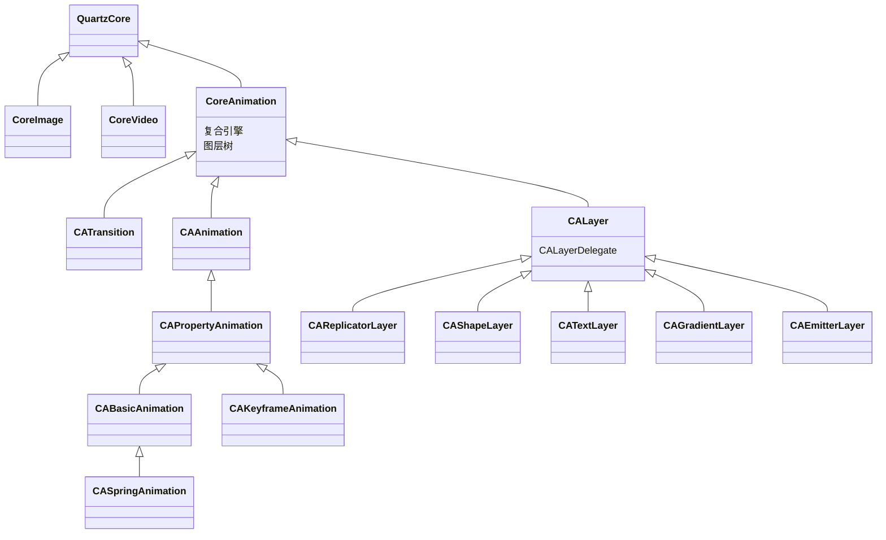
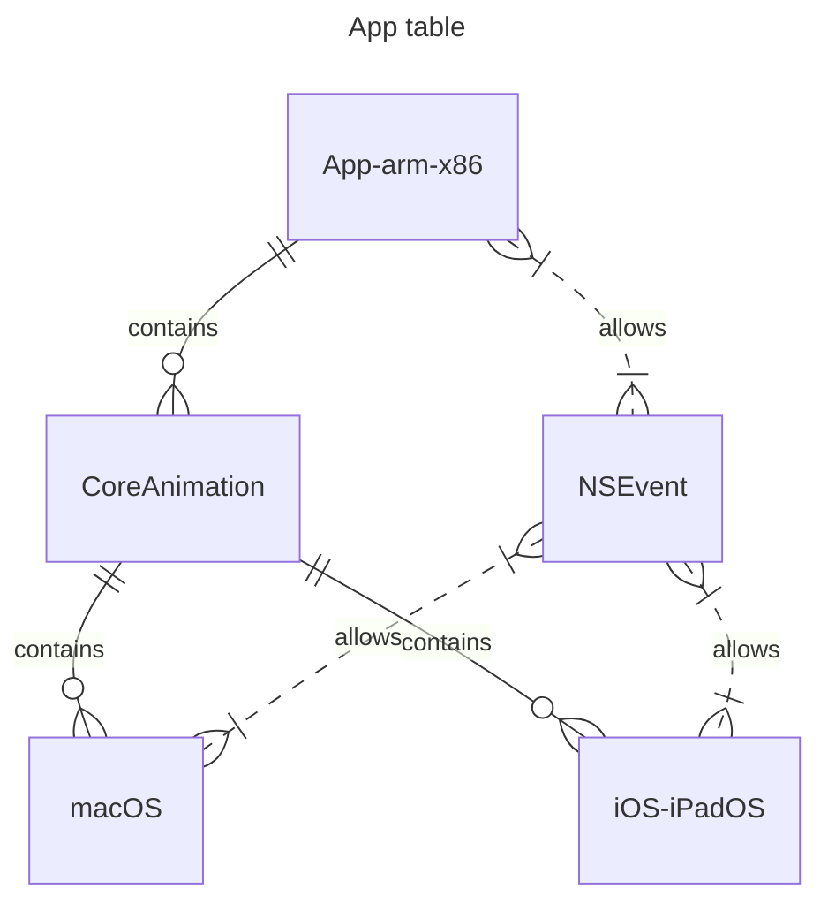
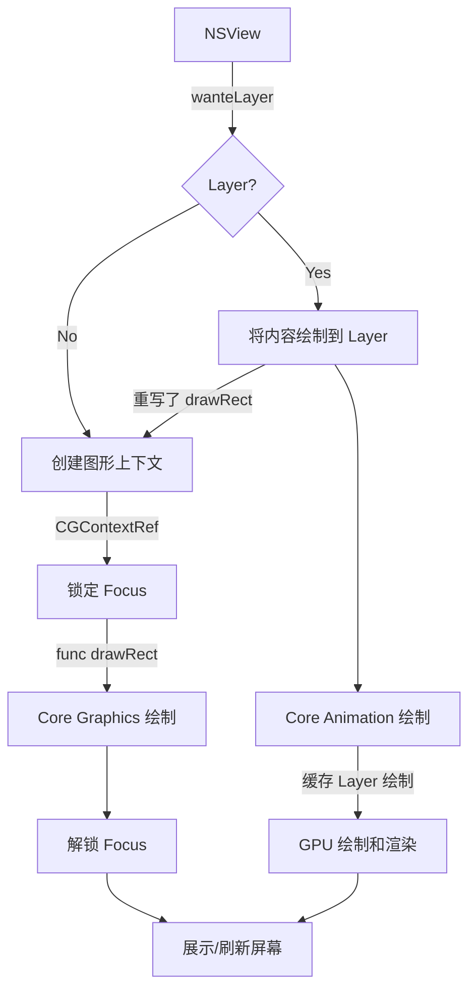
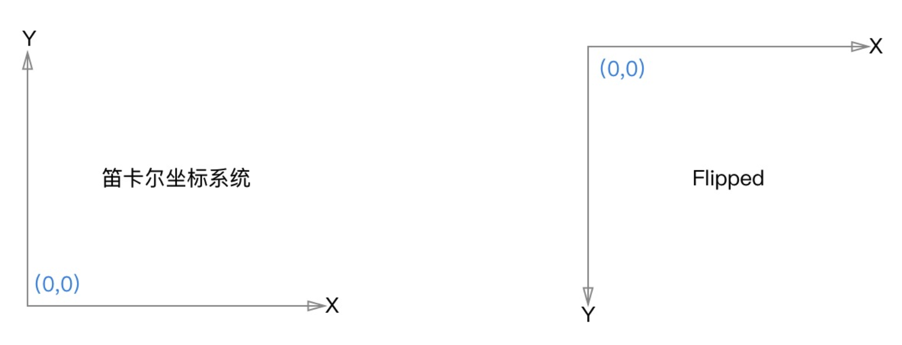
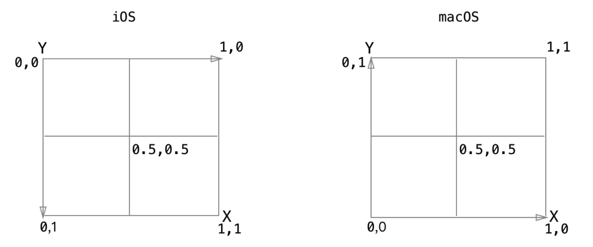
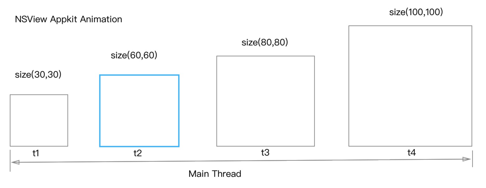
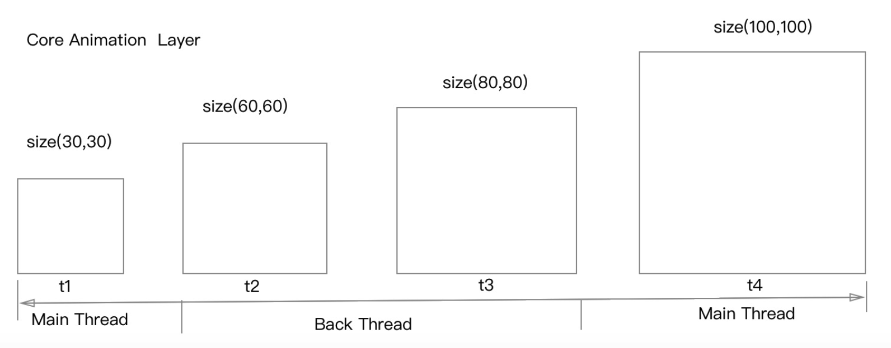

# macOS 渲染魔法：揭秘高性能图形与动画技巧

## 渲染框架

在 macOS 系统中，图形渲染主要由三个部分组成：**Core Graphics** 、**Core Animation** 和 **OpenGL/Metal **，负责将应用程序的图形界面绘制到屏幕上。


## Core Graphics

> Core Graphics 是一个二维图形渲染引擎，可以绘制矢量图形、文本和图像。它是 Quartz 2D 图形技术的底层引擎，提供了许多基于硬件加速的图形组合功能。Core Graphics 通过 CGContextRef 类型的图形上下文进行管理，为程序员提供了一种轻松地绘制图形元素的方法。


## OpenGL/Metal

> **OpenGL/Metal**: OpenGL（Open Graphics Library）是一个跨平台、开放的图形编程接口。它被广泛用于 3D 图形渲染，包括游戏、仿真和建模等应用。在 macOS 中，OpenGL 被用作 3D 图形渲染的核心技术。值得注意的是，近年来，苹果公司已经逐步转向 Metal 这一更先进的图形和计算框架。Metal 提供了对 GPU 的直接访问，并在性能方面优于 OpenGL。


## Core Animation

> Core Animation 是一个*复合引擎*，它的职责就是尽可能快地组合屏幕上不同的可视内容，这个内容是被分解成独立的*图层*，存储在一个叫做*图层树*的体系之中。
>
> 于是这个树形成了AppKit/UIKit 以及在 Apple 应用程序当中你所能在屏幕上看见的一切的基础。
>
> 还是一个基于硬件加速的动画框架，它可以让开发者轻松地创建复杂而流畅的动画效果还提供了一些高级功能，如隐式动画、关键帧动画、组合动画等。

在 macOS 平台上，Core Animation 主要用于为桌面应用程序提供高效且高质量的图形渲染和动画。开发者能够实现流畅的动画和视觉效果，提升用户体验。

主要功能：

1. **图层（Layer）**: 在 Core Animation 中，所有可见的界面元素都被表示为图层。图层负责管理其内容的几何形状、颜色、边框等属性。界面元素之间的树状结构由各个图层之间的父子关系表示。
2. **基于层的渲染：** Core Animation 使用 CALayer 管理图形内容，使能够更自然地组织、操作和控制场景中的各个元素。
3. **动画**: 提供多种动画类型，如基本动画、关键帧动画和弹簧动画等，方便实现各种复杂的视觉效果，Core Animation 会自动为这些属性变化生成相应的动画过程。
4. **硬件加速**: Core Animation 充分利用 GPU 进行图形渲染和动画处理，从而降低 CPU 负担，提高系统性能。
5. **与其他图形技术的集成**: 如前所述，Core Animation 可与 Core Graphics、OpenGL 和 Metal 配合使用，以实现更复杂的二维和三维图形效果。


### 架构结构图



### layer-backed view

> **Layer-backed view**（图层支持的视图）是在 macOS 和 iOS 中指代一种视图，它使用一个 Core Animation CALayer 渲染其内容。
>
> 具体来说，在 AppKit（macOS）或 UIKit（iOS）中，视图通常采用绘制方法（如 `drawRect:`）逐像素进行渲染。而对于 layer-backed view，系统会将其内容缓存在一个 CALayer 对象中，然后由 GPU 进行渲染。因此，layer-backed view 可以更有效地实现动画和复合效果。
>
> ### 优势：
>
> 1. **硬件加速：** 层的渲染过程由 GPU 完成，这意味着动画和视觉效果可以充分利用硬件加速，从而实现更高的性能。
> 2. **动画效果：** 利用 Core Animation 框架轻松添加动画，如移动、缩放、旋转等。
> 3. **视觉效果：** 支持阴影、圆角、遮罩等视觉元素的处理，以创建独特的 UI 设计。
> 4. **组合与嵌套：** 可以将多个 layer-backed view 堆叠在一起，形成复杂的场景，为应用程序增添活力。

在 macOS 下启用 layer 层：

```swift
class MyView: NSView {
    override init(frame: CGRect) {
        super.init(frame: frame)
        self.wantsLayer = true //启用 layer
    }
 }
```

```flow
st=>start: NSView
op=>operation: drawRect
la=>subroutine: CALayer
gpu=>operation: GPU
cond=>condition: wantLayer
e=>end
st->op->cond
cond(yes)->la->e
cond(no)->e
```


### macos Core Animation

> 在 macOS 启用 layer（layer-backed view 的机制） 层后，即每个视图都有一个对应的图层（layer），这个图层负责存储视图的内容和属性，并且可以独立地进行变换、过滤、遮罩等操作。

### iOS Core Animation

> 在 iOS 平台上，UIKit 框架默认采用 layer-backed view 机制。也就是说，每个 UIView 都会自动关联一个 Core Animation 层（CALayer）。这使得开发人员可以利用 Core Animation 的优势来实现高性能图形渲染和动画。


## CALayer

### contentsn (寄宿图) 

````gfm
/**
QuartzCore - CALayer.h 
*/

```swift
open class CALayer : NSObject, NSSecureCoding, CAMediaTiming { 
  open var contents: Any?
}
```
  
```objective-c
@interface CALayer : NSObject <NSSecureCoding, CAMediaTiming>
	@property(nullable, strong) id contents;
@end
```
````


### 为什么类型是一个 id 类型：

1. 由 MacOS 的历史原因造成的。它之所以被定义为 id 类型，是因为在 MacOS 系统上，这个属性对 `CGImage` 和 `NSImage` 类型的值都起作用。如果你试图在 iOS 平台上将 UIImage 的值赋给它，只能得到一个空白的图层。

2. 事实上，你真正要赋值的类型应该是 `CGImageRef`，它是一个指向 CGImage 结构的指针。

   1. `UIImage` 有一个 `CGImage` 属性，它返回一个 "CGImageRef",如果你想把这个值直接赋值给 `CALayer` 的 `contents`，将会得到一个编译错误。

      因为 CGImageRef 并不是一个真正的 `Cocoa` 对象，而是一个 Core Foundation 类型

```objective-c
/**
UIKit - UIImage.h 
*/
@property(nullable, nonatomic,readonly) CGImageRef CGImage; // returns underlying CGImageRef or nil if CIImage based
```

```swift
/**
CoreGraphics - CGImage.h 
*/
typedef struct CF_BRIDGED_TYPE(id) CGImage *CGImageRef;  /* Swift Sendable */
```

```objective-c
// 在 objective-c 语言下
UIImage *image = [UIImage imageNamed:@"name.png"];
UIView *view = UIView()
view.layer.contents = (__bridge id)image.CGImage; // Bridge the CGImageRef to id type
```


### contentsScale

和 `NSImage` / `UIImage` 不同，`CGImage` 没有拉伸的概念。当我们使用 NSImage 类去读取我们的图片的时候，他会读取高质量的 Retina 版本的图片。但是当我们用 CGImage 来设置我们的图层的内容时，拉伸这个因素在转换的时候就丢失了。所以我们需要通过手动设置 `contentsScale` 来修复这个问题


## NSView 与 UIView

给 contents 赋 CGImage 的值不是唯一的设置寄宿图的方法。我们也可以直接用 Core Graphics 直接绘制寄宿图。能够通过继承 NSView / UIView 并实现 `-drawRect:` 方法来自定义绘制。

### draw

```swift
open class NSView : NSResponder, ... {
    open var needsDisplay: Bool
    open func displayIfNeeded()
  
    open func setNeedsDisplay(_ invalidRect: NSRect)
    open func displayIfNeeded(_ rect: NSRect)
  
    open func display(_ rect: NSRect)
    open func display()

    open func draw(_ dirtyRect: NSRect)
}
```

### -drawRect 方法干了什么

* `-drawRect: `方法没有默认的实现，因为对 NSView 来说，寄宿图并不是必须的，它不在意那到底是单调的颜色还是有一个图片的实例。

* 如果 NSView 检测到 -drawRect: 方法被调用了，它就会为视图分配一个寄宿图，这个寄宿图的像素尺寸等于视图大小乘以 contentsScale 的值。


‼️ 如果你不需要寄宿图，那就不要创建这个方法了，这会造成 CPU 资源和内存的浪费，这也是为什么苹果建议：如果没有自定义绘制的任务就不要在子类中写一个空的 `-drawRect:` 方法。


### 事件与用户交互

在 iOS 和 MacOS 两个平台上，他们的事件和用户交互功能上很相似，但是在实现上有着显著的区别：

#### 响应链

`NSView` 对象遵循响应者链（responder chain），对事件进行传播。事件首先传递给最初接收事件的视图，如果该视图无法处理事件，则会沿着视图层级结构向上传递给父视图，直至被处理或传递给窗口和应用程序对象。

`UIView` 同样遵循响应者链。不过，与 macOS 不同，iOS 使用 `UIApplication`、`UIWindow` 和 `UIViewController` 这三者来处理事件传递和协调。

### 其它差异点

#### 不同之处：

NSView 和 UIView 作为两种不同的图形用户界面系统的基础，基于多点触控的用户界面和基于鼠标键盘有着本质的区别：

* UIView 默认包含一个 CALayer 对象。
* NSView 默认不包含 CALayer 对象。
* UIView 由 Core Animation 进行绘制。
* NSView 的绘制模型不同于 UIView，它使用 Core Graphics 来进行绘制。
* NSView 的子视图是由视图自身在绘制时直接渲染的。因此，NSView 不需要默认的 CALayer 来实现绘制和动画。
* 另一方面则是它们的默认图层行为

这就是为什么 iOS 有UIKit 和 UIView，但是 MacOS 有 AppKit 和 NSView 的原因。iOS 要基于 UIView 和 CALayer 提供两个平行的层级关系，原因在于要做职责分离，这样也能避免很多重复代码。

#### 相同之处：

* 自 macOS 10.12 和 iOS 10.0 开始，Apple 引入了一种新的图层支持方式：layer-backed views。这种方式下，NSView 也可以拥有 CALayer 对象

* 当您将 NSView / UIView 转换为 layer-backed 视图时，NSView / UIView 会自动创建一个新的 CALayer 对象，并将其添加到视图层次结构中。并使用 layer 的属性来设置视图的外观和行为
* 相比之下就是类似 Mac 笔记本和桌面系列一样应用于 iPhone 和 iPad 触屏的概念。把这种功能的逻辑分开并应用到独立的 Core Animation 框架，苹果就能够在 iOS 和 MacOS 之间共享代码，使得 OS 开发团队和第三方开发者去开发两个平台的应用更加便捷。



### 性能优化建议：

1. 如果您需要实现复杂的图层效果和动画，那么使用 Layer 可能是更好的选择。
2. 如果您的视图比较简单，或者需要手动控制绘制，那么不使用 Layer 也是一个不错的选择。
3. 使用 Layer 后，视图的绘制和布局会变得更加复杂，ayer 的内存占用会相应增加。
4. 如果使用 Layer 后出现了性能问题，可以尝试调整视图的绘制和布局逻辑。

### 小结：

NSView 使用和不使用 Layer 的主要区别在于绘制和渲染的方式，这会影响性能、功能和视觉效果。

具体使用时需要根据实际情况进行选择。

**预测**：*在 macOS 10.12 苹果就已经开始布局使用 Core Animation 进行多端代码共享*


## 视图与层

> 视图是层的代理，实现了 `CALayerDelegate` 协议。

层在渲染显示时，调用链关系依次如下：

```flow
st=>start: CALayer dispaly 
op=>operation: CALayer draw(in ctx: CGContext) 
ndi=>operation: NSView draw(_ :CALayer, in ctx: CGContext)
nd=>operation: NSView draw(_ dirtyRect: NSRect)
e=>end
st->op->ndi->nd
```


## Core Animation 与 Core Graphics

使用 Layer 的一些优缺点：

1. 优点：

\- 使用 Layer 可以实现更高效的绘制和更流畅的动画效果，因为 Layer 使用 GPU 加速来进行绘制和渲染。

\- 使用 Layer 还可以实现更丰富的视觉效果，例如阴影、透明度、旋转等。


2. 缺点：

\- 使用 Layer 会占用更多的内存，因为 CALayer 对象需要额外的资源来进行管理和渲染。

\- 使用 Layer 还可能导致一些性能问题，例如视图层次结构比较复杂时，Layer 的内存占用可能会相应增加，从而导致性能下降。

\- 在使用 Layer 时，还需要注意视图的布局和约束，以确保 Layer 的绘制和渲染是正确的。


## 渲染流程

### 图形渲染流程:

1. 应用程序构建用户界面。
2. 根据需要，Core Graphics 或 OpenGL/Metal 对界面元素进行绘制。
3. 绘制好的图形元素由 Window Server 合成后显示在屏幕上。
4. 硬件加速: macOS 使用硬件加速技术以实现更高效的图形渲染。GPU 被用于处理图形绘制任务，从而减轻 CPU 负担，使系统运行更加流畅。

```flow
st=>start: AppKit / NSView 
op=>operation: drawRect
ca=>subroutine: Core Animation (CALayer)
cg=>subroutine: Core Graphics
gpu=>operation: GPU
cond=>condition: wantLayer
e=>end
st->op->cond
cond(yes)->ca->e
cond(no)->cg->e
```

### 开启 Layer 详细流程

当 NSView 使用了 Layer 后，视图的绘制流程如下：

1. NSView 在初始化时会自动创建一个 CALayer 对象，并将该 Layer 对象添加到视图的层级结构中。

2. 当需要对视图进行绘制时，NSView 会调用 drawRect(:) 方法，将需要绘制的内容绘制到视图的 Layer 上。

3. Layer 接收到绘制请求后，会将绘制请求提交给 Core Animation，并使用 GPU 进行绘制和渲染。同时，Layer 还会对绘制结果进行缓存和优化，以提高性能和响应速度。

4. 当需要更新视图内容时，NSView 会调用 setNeedsDisplay(:) 方法，标记视图需要重绘。此时，Layer 会自动对视图的内容进行重绘，并将重绘后的结果绘制到屏幕上。

5. 在视图绘制的过程中，Layer 会自动进行一些优化和调整，以确保视图的内容能够正确地绘制和显示。这些优化和调整包括：

   - 视图的裁剪：Layer 可以对视图进行裁剪，以去除不需要的部分，从而减少不必要的绘制操作。

   - 视图的缩放：Layer 可以对视图进行缩放，以调整视图的大小，从而适应不同的显示设备和屏幕分辨率。

   - 视图的旋转：Layer 可以对视图进行旋转，以实现不同的视觉效果和动画效果。

   - 视图的遮罩：Layer 可以使用遮罩来隐藏或显示视图的不同部分，从而实现更多的视觉效果。

   - 视图的混合：Layer 可以使用不同的混合模式来混合视图的不同部分，从而实现更多的视觉效果。


6. 在代理的 draw(:) 方法中，绘制的内容会被存储到 Layer 的内容中，而不是直接绘制到屏幕上。这个过程中可以使用 Core Graphics 等绘图库来绘制视图的内容，也可以将其它 Layer 的内容作为当前 Layer 的一部分进行绘制。

7. 绘制完成后，Layer 会调用其 display() 方法来通知 NSView 需要重新绘制。由于绘制的结果被存储在 Layer 的内容中，因此不需要每次都重新绘制，可以大大提高重绘的效率。

8. NSView 会调用其 draw(:) 方法来重绘视图的内容，并将重绘后的结果绘制到屏幕上。这个过程会使用 Layer 的内容来进行绘制，从而避免了重复绘制的开销。

9. 如果视图的 Layer 有子 Layer，上述流程会递归执行子 Layer 的绘制过程，直到所有 Layer 都完成绘制为止。




## macOS 和 iOS 差异

### 坐标

>iOS 用点作为屏幕的坐标测算体系就是为了在 Retina 设备和普通设备上能有一致的视觉效果

#### 点

> 点就像是虚拟的像素，也被称作逻辑像素。在标准设备上，一个点就是一个像素，但是在Retina设备上，一个点等于2*2个像素。iOS用点作为屏幕的坐标测算体系就是为了在Retina设备和普通设备上能有一致的视觉效果。

macOS 和 iOS 在坐标系方面有所不同。macOS 使用了一个左下角为原点、y轴向上为正方向的坐标系，而 iOS 使用了一个左上角为原点、y轴向下为正方向的坐标系。因此，在处理位置、旋转等变换时需要注意转换坐标系。

```swift
/// 也可通过重写这个方法进行反转坐标
func isFlipped -> Bool {
 return true
}
```




锚点（AnchorPoint）：



#### 像素

> 物理像素坐标并不会用来屏幕布局，但是仍然与图片有相对关系。
>
> `NSImage` 是一个屏幕分辨率解决方案，所以指定点来度量大小。
>
> 但是一些底层的图片表示如 `CGImage` 就会使用像素，所以你要清楚在 Retina 设备和普通设备上，他们表现出来了不同的大小。

macOS 和 iOS 在像素密度方面有所不同。macOS 通常使用72ppi（每英寸像素数）作为屏幕分辨率，而 iOS 则根据不同设备有不同的像素密度（如 Retina 屏幕）。因此，在处理尺寸、缩放等变换时需要注意适配不同设备。

### 绘制和渲染

`NSView` 中，绘制和渲染默认是直接在视图表面进行的。通过实现 `drawRect:` 方法并使用 Cocoa 绘图方法（如 `NSBezierPath`、`NSImage` 等）或 Core Graphics API，可以完成绘制任务。虽然可以使用 Core Animation 提供的 layer 来进行硬件加速渲染，但这并非默认选项。

`UIView` 默认启用了 Core Animation 提供的 layer。在 `UIView` 中，你可以重写 `drawRect:` 方法来实现自定义绘制，但更常见的做法是使用 layer 的属性或者添加子 layer 来实现视图的内容和动画。

### 视图层级

macOS 和 iOS 在视图层级方面有所不同。macOS 中每个窗口都有一个根视图（NSView），所有其他视图都是根视图或其子视图；而iOS中每个窗口都有一个根控制器（UIViewController），所有其他视图都是根控制器或其子控制器所管理的视图。

### 响应链

`NSView` 对象遵循响应者链（responder chain），对事件进行传播。事件首先传递给最初接收事件的视图，如果该视图无法处理事件，则会沿着视图层级结构向上传递给父视图，直至被处理或传递给窗口和应用程序对象。

`UIView` 同样遵循响应者链。不过，与 macOS 不同，iOS 使用 UIApplication、UIWindow 和 UIViewController 这三者来处理事件传递和协调。

### 其它差异

...


## 动画

### 坐标变换

```swift
let xform = NSAffineTransform()

/// 对坐标系进行x和y轴分别进行20个像素的移动后，基于原来的位置
xform.translateX(by: 10, yBy: 10)

/// 分别对坐标系中图形的点坐标沿x轴和y轴进行2倍拉伸
xform.scaleX(by: 2.0, yBy: 2.0)

/// 将坐标系沿原点旋转 90度
xform.rotate(byDegrees: 90)

xform.concat()
```

变换公式：
$$
\mathbf[{x} & \mathbf{y} & \mathbf 1] * \begin{vmatrix}
\mathbf{m11} & \mathbf{m12} & \mathbf{0} \\
\mathbf{m21} & \mathbf{m22} & \mathbf{0} \\
\mathbf{tx} & \mathbf{ty} & \mathbf{1} \\ 
\end{vmatrix} = 
\mathbf[{x1} & \mathbf{y1} & \mathbf 1]
$$

> 其中 [x y 1] 表示原坐标, [x1 y1 1] 为变换后的坐标
> 用数学表达式表示如下：
>
> x1 = m11 \* x + m12 \* y + tx
> y1 = m21 \* x + m22 \* y + ty
>
> 具体换算步骤：
>
> ```
> 1. 缩放 (Scaling)：
>    x' = m11 * x
>    y' = m22 * y
> 2. 旋转 (Rotation)：
>    x'' = x' + m12 * y'
>    y'' = m21 * x' + y'
> 3. 平移 (Translation)：
>    x1 = x'' + tx
>    y1 = y'' + ty
> ```
>
> 
>
> m11, m22为缩放系数，m12, m21为旋转系数, tx, ty为平移系数

注：换算后的最后一个1: 齐次坐标

> 在仿射变换中，使用齐次坐标 (homogeneous coordinates) 表示原始坐标和变换后的坐标。这里，最后那个 1 是齐次坐标的一部分，用于保持矩阵乘法的一致性。具体来说，在二维平面上，我们将每个点扩展为三维坐标，其中第三个分量始终为 1。
>
> 这样做的目的是方便表示和计算仿射变换（如平移、旋转、缩放等），并允许我们使用一个 3x3 矩阵将这些变换合并为一个操作。
>
> 例如，原始坐标 [x y] 变换为齐次坐标 [x y 1]。经过仿射变换后，我们得到 [x1 y1 w]，其中 w 通常等于 1。由于我们只关心二维平面上的结果，因此可以将结果坐标除以 w，即 [x1/w y1/w]，在本例中简化为 [x1 y1]。 这里为了简化，直接写成 [x1 y1 1]，但实际上我们使用的是 [x1 y1]。

**变换数学表达式中是乘法和加法的混合运算，因此不支持2种不同的变换之间交换顺序。也就是说先旋转后缩放和先缩放后旋转的效果不是等价的。**


### 变换撤销/还原

如果应用了变换操作，则当前绘图上下文中后续所有的绘图相关操作都会受到影响。

如果希望变换只影响部分的绘制，可以在需要变换的代码执行完成后，使用invert来撤销变换操作，后续的绘图就不在受变换的影响。

```swift
let xform = NSAffineTransform()
...code...

// 使用 invert 方法计算复制的实例的逆矩阵
xform.invert()

// 修改当前上下文的变换，
// 将原始变换与逆变换相结合，这样后续绘图操作不会受到影响
xform.concat()
```


### 绘图状态

使用 saveGraphicsState 保持绘图状态，完成绘圈后使用 restoreGraphicsState 恢复。
saveGraphicsState 和 restoreGraphicsState 必须对应成对出现。

```swift
// 保持绘制状态
NSGraphicsContext.saveGraphicsState()
// 设置新绘图属性
NSColor.red.set()
...
// 绘制操作
NSGraphicsContext.current?.cgContext.strokePath()
...
// 恢复绘制状态
NSGraphicsContext.restoreGraphicsState()
```

由于invert是数学浮点数矩阵运算，本身可能有精度损失。因此我们更推荐使用绘图状态保存方法去恢复绘图状态。


### 隐式动画

```swift
NSAnimationContext.current.allowsImplicitAnimation = true
```

修改 `NSAnimationContext` 的 `allowslmplicitAnimation` 为 `true` 后，则直接修改视图的属性就会产生动画仅支持 `frame`、`frameSize`、`frameOrigin` 3个属性；更多的属性动画需要 layer-backed 的视图。

#### 产生过程

1. 查找实现了 `CAAction` 协议的动画对象

   修改一个层的属性，立即触发它的 `actionForkey:` 方法去查找 CAAction 类型对象，查找流程依次如下

   1. 优先检测层是否有 delegate 并旦实现了 `action(forKey:) -> CAAction?` 方法。如果有返回 CAAction 类型对象，则返回这个对象; 如果返回 `nil` 则继续分支流程处理；如果返回 `NSNull` 则结束后续搜索分支
   2. 通过 key 查找层的 actions 字典。如果查找成功则返回 `CAAction` 类型对象，否则继续下一步去查找
   3. 查找层的 style 宇典中的 key 为 action 的字典。如果不为空则在新的 action 字典中继续用 key 去查找
   4. 执行层的 `defaultAction(forKey:) -> CAAction?` 方法查找

2. 执行 `CAAction` 协议,创建一个显式动面
   1. 对搜索到的动面对象，执行 CAAction 协议方法 `run(forKey:, object:, arguments:)`, 
      1. 这个方法的第一个参数 key 为一个 `CALayer` 属性名称，第二个参数 object 为 `CALayer` 层对象。
      2. 执行的过程是在 CALayer 层上根据属性参数修改前和修改后的值，通过层的 `animation(forKey:)-> CAAction?` 方法，创建一个显式动画。
   2. 对于正常的 NSView/UIView 的 layer 的属性修改，并不产生隐式动画的原因在于执行上述隐式动画搜索过程时 `action(forKey:) -> CAAction?` 方法返回 nil，因此不会创建最终的动面。

```swift
// 原代码
open class CALayer : NSObject, NSSecureCoding, CAMediaTiming {
    open class func defaultAction(forKey event: String) -> CAAction?
    open func action(forKey event: String) -> CAAction?
    open func animation(forKey key: String) -> CAAnimation?
    open var actions: [String : CAAction]?
    open var style: [AnyHashable : Any]?
}
```


#### CATransaction

* 使用 `CATransaction` 设置隐式动画的时间

```swift
CATransaction.begin()
CATransaction.setAnimationDuration(1)
view.layer?.position = CGPoint(x: 10, y: 10)
view.layer?.opacity = 0.2
CATransaction.commit()
```

* 关闭隐式动画的代码示例

```swift
CATransaction.begin()
CATransaction.setValue(true, forKey: kCATransactionDisableActions)
view.layer?.opacity = 0.2
CATransaction.commit()
```

#### animations

视图的 `animations` 中存储了属性关联的动画。修改属性时，优先从这个字典获取属性对应的动画。

```swift
let keyAnimation = CAKeyframeAnimation()
keyAnimation.values = [NSColor.green, NSColor.red, NSColor.yellow]
view.animations = ["fullColor": keyAnimation]
view.animator.fullColor = NSColor.purple
```

#### NSAnimationContext

通过 `NSAnimationContext` 动面上下文对象，可以对动画的时长、时间函数、是否允许隐式动画等做全局控制。

```swift
NSAnimationContext.runAnimationGroup({ context 
    context.duration = 0.5
		// 是否允许隐式动画等
    context.allowsImplicitAnimation = true
    if targetView.alphaValue == 1.0 {
        targetView.animator().alphaValue = 0.3
    } else {
        targetView.animator().alphaValue = 1.0
    }
}, completionHandler：{
  // 执行完成
})
```


### NSViewAnimation

通过 NSViewAnimation 定义动画

```swift
let view: NSView = ...
let viewDict: [NSViewAnimation.Key: Any] = [
    .target: view,
    .startFrame: view.frame,
    .endFrame: NSRect(origin: origin, size: view.frame.size),
    .effect: NSViewAnimation.Effect.fadeIn
]
let animation = NSViewAnimation(viewAnimations: [viewDict])
animation.duration = duration
animation.animationCurve = .easeInOut
animation.animationBlockingMode = .nonblocking
animation.start()
```

### AutoLayout 动画

增加AutoLayout约束后，通过在NSAnimationContext的runAnimationBlock方法中执行视图或窗口的更新方法实现隐式动面。

```swift
NSAnimationContext.runAnimationGroup({ context in
    context.duration = 0.5
    context.allowsImplicitAnimation = true
    // 让其在当前动画上下文中更新约束，产生动画  
    view.layoutSubtreeIfNeeded()
}, completionHandler: nil)
```


### Core Animation

与 iOS 一样，这里略过


### CAMediaTimingFunction

辅助类 `CAMediaTimingFunction` 通过 `init(name:)` 方法，提供系统实现的几种动面效果。也可以通过指定控制点构造贝塞尔曲线实现基于路径变化的动画效果。


### AppKit Animation Vs Core Animation

1.AppKit 动画做为视图的属性存储，运行在主线程；drawRect 绘制周期修改视图的属性。
2.Core Animation 动画作为 CALayer 的属性存储，运行在后台线程；只修改渲染层的属性。

下面是视图 size 变化时动画过程，Core Animation 只有在开始的t1和最后的t4时刻工作在主线程，其他时刻均在后台线程运行。






## 性能优化

### 减少层的数量：
在 OSX 中的视图设置了 `wantsLayer=true` 后，所有子视图都有了 Layer 层，如果图层较多会带来了性能问题：

* 每个层有自己的图像存储区，更多的层产生了额外的内存开销
* 多个层图象合成的开销
* 隐藏的图层也会产生合成的代价
* 在设置了视图的 `wantslayer=true` 后，通过设置视图的 `canDrawSubviewsIntoLayer=true` 。这样每个子视图就不会使用 Layer 层。如果某个子视图需要使用层，可以单独自己设置允许使用层。


### 属性操作

尽可能避免操作影响性能的下面属性

```swift
open class CALayer : NSObject, NSSecureCoding, CAMediaTiming {
    open var cornerRadius: CGFloat
 		open var filters: [Any]?
    open var backgroundFilters: [Any]?
    open var mask: CALayer?
}
```


### isOpaque

尽可能设置视图的非透明属性 `isOpaque=true`

- 非透明视图： 当视图的 `isOpaque` 属性设置为 `true `时，系统假定视图是完全不透明的。在绘制过程中，Core Animation 会跳过渲染与此视图重叠的其他视图部分，从而降低渲染负担并提高性能。
- 透明视图： 当视图的 `isOpaque` 属性设置为 `false` 时，系统会考虑视图的透明度。在绘制过程中，系统会将所有与此视图重叠的视图进行组合计算，以正确显示透明度效果。这会导致更多的渲染计算和性能损耗，特别是在动画过程中。

因此，为了提高动画性能，如果一个视图本身不需要透明度效果，将其 `isOpaque`属性设置为 `true` 可以让系统跳过不必要的渲染计算，从而降低渲染负担并提高性能。


### UpdateLayer 优化绘制

使用 UpdateLayer 优化绘制

#### 传统的视图绘制： 

在 AppKit 中，传统的视图绘制是通过重写 `drawRect:` 方法来完成的，该方法会在 CPU 上执行绘制相关操作。这种方式适用于需要精确控制视图内容的情况。然而，由于绘制操作是在 CPU 上完成的，这可能会导致性能开销和较慢的动画效果。

#### 使用 `updateLayer` 优化绘制： 

让视图以 layer-backed（基于层）的方式进行绘制。为此，需要重写视图的 `wantsUpdateLayer` 方法并返回 `true`，这样视图就不再调用 `drawRect:` 方法而是调用 `updateLayer` 方法。在 `updateLayer` 方法中，您可以直接修改层的内容，例如设置背景颜色、图片等。因为层的操作由 Core Animation 在 GPU 上执行，所以这种方式可以提高渲染和动画性能。

```flow
st=>start: CALayer dispaly
upcond=>condition: NSView wantsUpdateLayer
nsdi=>operation: NSView draw(:CALayer, in: CGContext)
nsu=>operation: NSView updateLayer
nsd=>operation: NSView draw(: NSRect)
e=>end: layer contents
st->upcond->nsdi
upcond(yes)->nsu->e
upcond(no)->nsdi->nsd->e
```


《macOS 开发实用技巧、实践》
